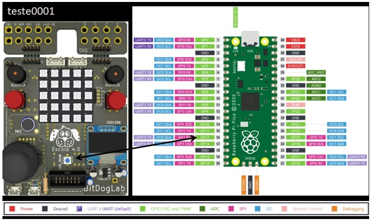
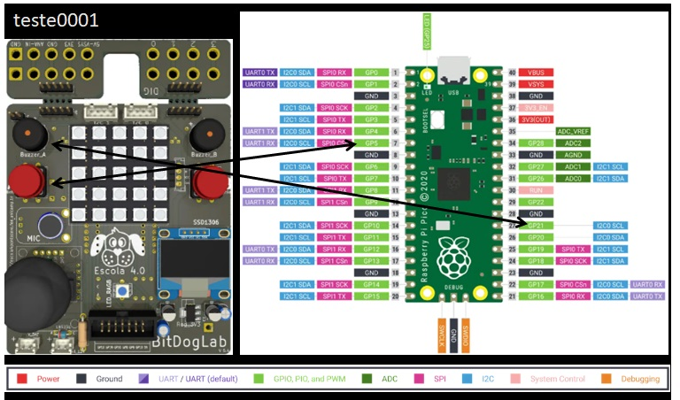

🚀 Adicionando teste0001 Bitdoglab - blink_bdl

📌 Descrição

Este teste inicial consiste em fazer um LED piscar utilizando a Raspberry Pi Pico.

O código foi desenvolvido em C/C++ e testado no ambiente Bitdoglab.

📝 Documentar as dependências e configurações do ambiente.

Código completo em C: blink_bdl.c
Arquivo CMake: Cmakefiles.txt 

🔧 Status

🚧 Testado

___
🚀 Adicionando teste0002 Bitdoglab - blink_bdl

📌 Descrição

Este teste inicial consiste em fazer um LED piscar utilizando a Raspberry Pi Pico.

O código foi desenvolvido em C/C++ e testado no ambiente Bitdoglab.

📝 Documentar as dependências e configurações do ambiente.

Código completo em C: blink_bdl.c
Arquivo CMake: Cmakefiles.txt 

🔧 Status

🚧 Testado

___
🚀 Adicionando teste0001 Bitdoglab - button_buzzer_bdl

📌 Descrição

Este teste inicial consiste em fazer um Botão que aciona o buzzer utilizando a Raspberry Pi Pico.

O código foi desenvolvido em C/C++ e testado no ambiente Bitdoglab.

📝 Documentar as dependências e configurações do ambiente.

Código completo em C: button_buzzer_bdl.c
Arquivo CMake: Cmakefiles.txt 

🔧 Status

🚧 Testado

___

___

📋 Lista de Testes

🟢 Teste 0001 - blink_bdl
🟢 Teste 0002 - blink_bdl
