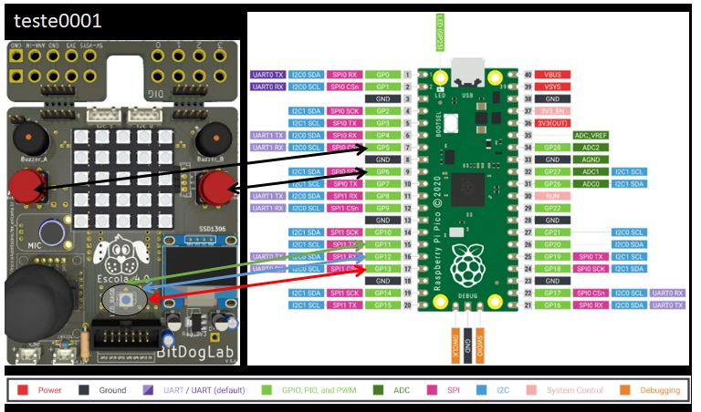
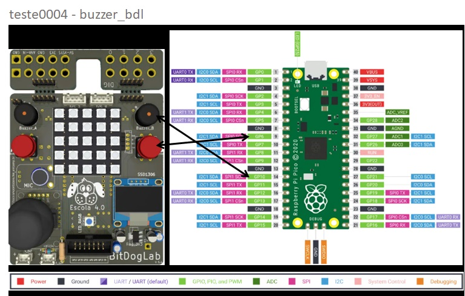
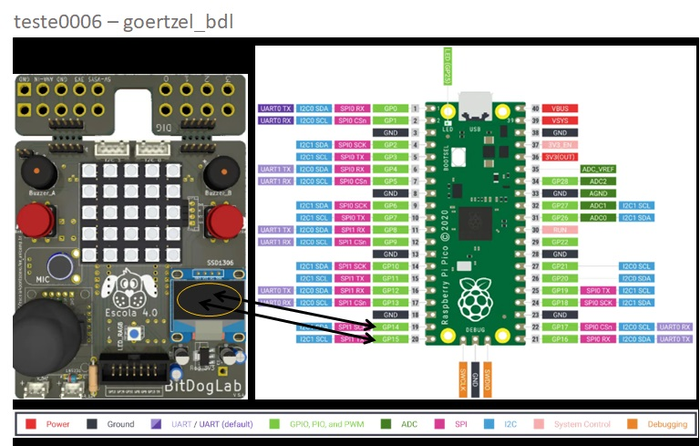

### Observação importante:
Pelo fato da instalação e configuração de compilação do CMake ser otimizada para
mínima modificação, todos os exemplos desta lista precisarão ser adequados a configuração da máquina
onde forem ser executados. Sem essas alterações o código pode não apresentar o comportamento desejado!
___
🚀 Adicionando teste0001 Bitdoglab - blink_bdl

📌 Descrição

Este teste inicial consiste em fazer um LED piscar utilizando a Raspberry Pi Pico. Consiste na simulação de utilizar os GPIO'S
que deverão acionar a LED_PIN_LIGHT(iluminação geradora de calor) e a LED_PIN_FAN(ventilação retirando ar quente do ambiente).

O código foi desenvolvido em C/C++ e testado no ambiente Bitdoglab.

📝 Documentar as dependências e configurações do ambiente.

Código completo em C: blink_bdl.c
Arquivo CMake: Cmakefiles.txt 

🔧 Status

🚧 Testado

___
🚀 Adicionando teste0002 Bitdoglab - button_buzzer_bdl

📌 Descrição

Este teste inicial consiste em fazer um Botão A que aciona o Buzzer A utilizando a Raspberry Pi Pico.

O código foi desenvolvido em C/C++ e testado no ambiente Bitdoglab.

📝 Documentar as dependências e configurações do ambiente.

Código completo em C: button_buzzer_bdl.c
Arquivo CMake: Cmakefiles.txt 

🔧 Status

🚧 Testado

___
🚀 Adicionando teste0003 Bitdoglab - blink_rgb_bdl

📌 Descrição

Este teste inicial consiste em fazer um Botão A e B acionar o LED RGB quando acionados utilizando a Raspberry Pi Pico.

O código foi desenvolvido em C/C++ e testado no ambiente Bitdoglab.

📝 Documentar as dependências e configurações do ambiente.

Código completo em C: blink_rgb_bdl.c
Arquivo CMake: Cmakefiles.txt 

🔧 Status

🚧 Testado

___
🚀 Adicionando teste0004 Bitdoglab - buzzer_bdl

📌 Descrição

Este teste inicial consiste em ao precionar o Botão B e Buzzer B emitir um beep com duração especificada, utilizando a Raspberry Pi Pico.

O código foi desenvolvido em C/C++ e testado no ambiente Bitdoglab.

📝 Documentar as dependências e configurações do ambiente.

Código completo em C: buzzer_bdl.c
Arquivo CMake: Cmakefiles.txt 

🔧 Status

🚧 Testado

___
🚀 Adicionando teste0005 Bitdoglab - ssd1306_bdl

📌 Descrição

Este teste inicial consiste em exemplificar o uso do OLED (ssd1306) utilizando a Raspberry Pi Pico.

O código foi desenvolvido em C/C++ e testado no ambiente Bitdoglab.

📝 Documentar as dependências e configurações do ambiente.

Código completo em C: ssd1306_bdl.c
Arquivo CMake: Cmakefiles.txt 

🔧 Status

🚧 Testado

___
🚀 Adicionando teste0006 Bitdoglab - goertzel_bdl

📌 Descrição

Este teste inicial consiste em aplicar o Goertzel para detectar a frequência 261 Hz (Dó médio - C4) utilizando a Raspberry Pi Pico.

O código foi desenvolvido em C/C++ e testado no ambiente Bitdoglab.

📝 Documentar as dependências e configurações do ambiente.

Código completo em C: goertzel_bdl.c
Arquivo CMake: Cmakefiles.txt 

🔧 Status

🚧 Testado

___

📋 Lista de Testes

🟢 Teste 0001 - blink_bdl
🟢 Teste 0002 - button_buzzer_bdl
🟢 Teste 0003 - blink_rgb_bdl
🟢 Teste 0004 - buzzer_bdl
🟢 Teste 0005 - ssd1306_bdl
🟢 Teste 0006 - goertzel_bdl
