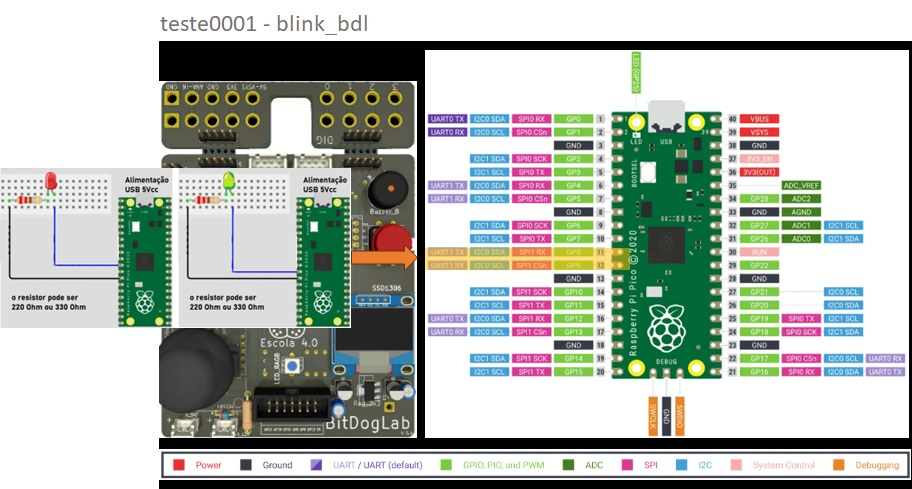
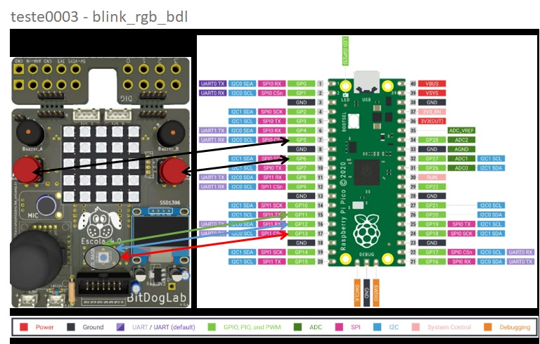

### Observação importante:
Pelo fato da instalação e configuração de compilação do CMake ser otimizada para
mínima modificação, todos os exemplos desta lista precisarão ser adequados a configuração da máquina
onde forem ser executados. Sem essas alterações o código pode não apresentar o comportamento desejado!
___
```cmake
cmake_minimum_required(VERSION 3.12)

# Pull in SDK (must be before project)
include(pico_sdk_import.cmake)
include(pico_extras_import_optional.cmake)

project(pico_examples C CXX ASM)

set(CMAKE_C_STANDARD 11)
set(CMAKE_CXX_STANDARD 17)

if (PICO_SDK_VERSION_STRING VERSION_LESS "2.1.0")
    message(FATAL_ERROR "Raspberry Pi Pico SDK version 2.1.0 (or later) required. Your version is ${PICO_SDK_VERSION_STRING}")
endif()

set(PICO_EXAMPLES_PATH ${PROJECT_SOURCE_DIR})

# If you want debug output from USB (pass -DPICO_STDIO_USB=1) this ensures you don't lose any debug output while USB is set up
if (NOT DEFINED PICO_STDIO_USB_CONNECT_WAIT_TIMEOUT_MS)
    set(PICO_STDIO_USB_CONNECT_WAIT_TIMEOUT_MS 3000)
endif()

# Initialize the SDK
pico_sdk_init()

include(example_auto_set_url.cmake)

# Adiciona o executável
add_executable(ssd1306_oled_bdl
    src/ssd1306_oled_bdl.c
    src/ssd1306.c
    src/adc_setup.c
    src/i2c_setup.c
    src/oled_setup.c
    src/temperature.c
)

# Diretórios de inclusão
target_include_directories(ssd1306_oled_bdl
    PUBLIC
    ${CMAKE_CURRENT_SOURCE_DIR}/include
)

# Linka as bibliotecas necessárias
target_link_libraries(ssd1306_oled_bdl pico_stdlib hardware_i2c hardware_adc)

# Habilita USB e desabilita UART
pico_enable_stdio_usb(ssd1306_oled_bdl 1)
pico_enable_stdio_uart(ssd1306_oled_bdl 0)

# Gera arquivos extras (map/bin/hex/uf2)
pico_add_extra_outputs(ssd1306_oled_bdl)

# Adiciona URL do projeto
example_auto_set_url(ssd1306_oled_bdl)

if (TARGET hardware_i2c)
    add_subdirectory_exclude_platforms(ssd1306_oled_bdl)
else()
    message("Skipping I2C examples as hardware_i2c is unavailable on this platform")
endif()
```
___
🚀 Adicionando teste0001 Bitdoglab - blink_bdl

📌 Descrição

Este teste inicial consiste em fazer um LED piscar utilizando a Raspberry Pi Pico. Consiste na simulação de utilizar os GPIO'S
que deverão acionar a LED_PIN_LIGHT(iluminação geradora de calor) e a LED_PIN_FAN(ventilação retirando ar quente do ambiente).

O código foi desenvolvido em C/C++ e testado no ambiente Bitdoglab.

📝 Documentar as dependências e configurações do ambiente.

Código completo em C: blink_bdl.c
Arquivo CMake: Cmakefiles.txt 

🔧 Status

🚧 Testado


___
🚀 Adicionando teste0002 Bitdoglab - button_buzzer_bdl

📌 Descrição

Este teste inicial consiste em fazer um Botão A que aciona o Buzzer A utilizando a Raspberry Pi Pico.

O código foi desenvolvido em C/C++ e testado no ambiente Bitdoglab.

📝 Documentar as dependências e configurações do ambiente.

Código completo em C: button_buzzer_bdl.c
Arquivo CMake: Cmakefiles.txt 

🔧 Status

🚧 Testado


___
🚀 Adicionando teste0003 Bitdoglab - blink_rgb_bdl

📌 Descrição

Este teste inicial consiste em fazer um Botão A e B acionar o LED RGB quando acionados utilizando a Raspberry Pi Pico.

O código foi desenvolvido em C/C++ e testado no ambiente Bitdoglab.

📝 Documentar as dependências e configurações do ambiente.

Código completo em C: blink_rgb_bdl.c
Arquivo CMake: Cmakefiles.txt 

🔧 Status

🚧 Testado


___
🚀 Adicionando teste0004 Bitdoglab - buzzer_bdl

📌 Descrição

Este teste inicial consiste em ao precionar o Botão B e Buzzer B emitir um beep com duração especificada, utilizando a Raspberry Pi Pico.

O código foi desenvolvido em C/C++ e testado no ambiente Bitdoglab.

📝 Documentar as dependências e configurações do ambiente.

Código completo em C: buzzer_bdl.c
Arquivo CMake: Cmakefiles.txt 

🔧 Status

🚧 Testado


___
🚀 Adicionando teste0005 Bitdoglab - ssd1306_bdl

📌 Descrição

Este teste inicial consiste em exemplificar o uso do OLED (ssd1306) utilizando a Raspberry Pi Pico.

O código foi desenvolvido em C/C++ e testado no ambiente Bitdoglab.

📝 Documentar as dependências e configurações do ambiente.

Código completo em C: ssd1306_bdl.c
Arquivo CMake: Cmakefiles.txt 

🔧 Status

🚧 Testado


___
🚀 Adicionando teste0006 Bitdoglab - goertzel_bdl

📌 Descrição

Este teste inicial consiste em aplicar o Goertzel para detectar a frequência 261 Hz (Dó médio - C4) utilizando a Raspberry Pi Pico.

O código foi desenvolvido em C/C++ e testado no ambiente Bitdoglab.

📝 Documentar as dependências e configurações do ambiente.

Código completo em C: goertzel_bdl.c
Arquivo CMake: Cmakefiles.txt 

🔧 Status

🚧 Testado
___

📋 Lista de Testes

🟢 Teste 0001 - blink_bdl
🟢 Teste 0002 - button_buzzer_bdl
🟢 Teste 0003 - blink_rgb_bdl
🟢 Teste 0004 - buzzer_bdl
🟢 Teste 0005 - ssd1306_bdl
🟢 Teste 0006 - goertzel_bdl
